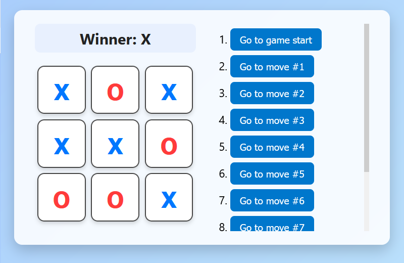

# 🎮 React Tic-Tac-Toe

A modern, colorful implementation of the classic **Tic-Tac-Toe** game built with **React**.  
Supports time travel (move history), dynamic status updates, and a polished UI.

---

## ✨ Features
- 🟦 **Interactive game board** with X (blue) and O (red) styling
- 🏆 **Winner detection** for rows, columns, and diagonals
- ⏪ **Move history with time travel** — jump back to any previous state
- 📜 **Scrollable move list** (with a sticky status bar)
- 🎨 **Modern, responsive UI** with gradient background, hover effects, and mobile-friendly design

---

## 📂 Project Structure
src/
├── App.js # Main game logic (Game, Board, Square components)
├── index.js # React entry point
├── styles.css # Full custom styling


---

## 🚀 Getting Started

### 1. Clone the repo
```bash
git clone https://github.com/MahsaSin/tic-tac-toe.git
cd tic-tac-toe
```

### 2. Install dependencies
```bash
npm install
```

### 3. Run the app
```bash
npm start
```

App will be available at 👉 http://localhost:3000

## Preview


## Technologies Used

React (with hooks: useState)
Modern CSS (Flexbox, Gradients, Transitions)

## How to Play
1. Player X always goes first.
2. Click any empty square to place your mark.
3. The game will declare a winner once three in a row are achieved.
4. Use the move history list to jump back in time.